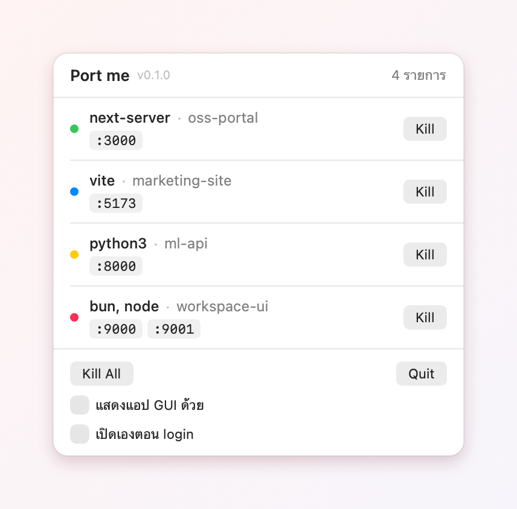

# Port me

แอป menu bar บน macOS สำหรับหา dev server ที่ยังถือ port ค้างอยู่แล้วฆ่าทิ้งด้วยคลิกเดียว — node, bun, pnpm, yarn, python และอะไรก็ตามที่คุณเปิดเอง

<p align="center">
  
</p>

## ติดตั้ง

ยังไม่มีไฟล์สำเร็จรูปแจก ต้อง build เองซึ่งใช้เวลาไม่ถึงนาที

**ต้องมี:** macOS 14 ขึ้นไป และ Swift toolchain — ถ้ายังไม่มี ติดตั้งด้วย `xcode-select --install` (Command Line Tools พอ ไม่ต้องลง Xcode เต็ม)

```bash
git clone https://github.com/apisit19122/port-me.git
cd port-me
./scripts/bundle.sh
cp -r dist/PortMe.app /Applications/
open /Applications/PortMe.app
```

ไอคอนปลั๊กสีแดงจะโผล่บน menu bar แอปไม่มีหน้าต่างและไม่มีไอคอนใน Dock

คัดลอกไปไว้ `/Applications` เพราะ "เปิดเองตอน login" ผูกกับตำแหน่งไฟล์ — ถ้าย้ายแอปทีหลังต้องปิดแล้วเปิด toggle ใหม่ จะรันจากที่อื่นก็ได้ แต่ให้อยู่กับที่

แอปเซ็นแบบ ad-hoc (ไม่ได้ notarize กับ Apple) ซึ่งไม่มีปัญหาเพราะ build จากเครื่องตัวเอง แต่ถ้าไปคัดลอก `.app` ข้ามเครื่อง macOS จะกักไว้ — เครื่องปลายทาง build เองจะง่ายกว่า

### อัปเดตเป็นเวอร์ชันใหม่

```bash
git pull && ./scripts/bundle.sh
pkill -x PortMe; cp -r dist/PortMe.app /Applications/ && open /Applications/PortMe.app
```

### ถอนออก

ลาก `/Applications/PortMe.app` ทิ้ง แล้วลบค่าที่จำไว้ด้วย `defaults delete com.oat.portme` — ถ้าเคยเปิด "เปิดเองตอน login" ให้ปิด toggle ก่อนลบแอป หรือเอาออกเองที่ System Settings → General → Login Items

## วิธีใช้

คลิกไอคอนปลั๊กบน menu bar แล้วจะเห็นรายการ dev server ที่ถือ port อยู่ตอนนั้น

| ปุ่ม | การทำงาน |
|---|---|
| Kill | ฆ่า dev server แถวนั้นทั้งต้น ไม่ถามยืนยัน |
| Kill All | ฆ่าทุกแถวที่แสดงอยู่ |
| แสดงแอป GUI ด้วย | เพิ่มแอปอย่าง OrbStack, Docker, VS Code helper เข้ามาในรายการ |
| เปิดเองตอน login | ลงทะเบียนเป็น login item (ใช้ได้เมื่อรันจาก `PortMe.app`) |

รายการรีเฟรชเองทุก 3 วินาทีขณะเปิดอยู่ ปิดแล้วไม่มีอะไรทำงานเบื้องหลัง

## หนึ่งแถวคือหนึ่ง dev server ไม่ใช่หนึ่ง process

`pnpm dev` ตัวเดียวกลายเป็นหลาย process — ตัว package manager, ตัวห่อ, แล้วค่อยเป็น runtime ที่จอง port จริง Port me ไต่ขึ้นจาก process ที่ถือ port จนชน shell แล้วนับทั้งต้นเป็นแถวเดียว

ผลคือ monorepo ที่รันคำสั่งเดียวแล้วได้สอง port จะเป็นหนึ่งแถวสองป้าย `:9000 :9001` ไม่ใช่สองแถวที่กดฆ่าอันหนึ่งแล้วอีกอันหายตามไปแบบไม่มีเหตุผล

การกด Kill ส่ง `SIGTERM` ทั้งต้นโดยเริ่มจากรากก่อน (ไม่งั้นตัว supervisor จะ respawn ลูกขึ้นมาใหม่) รอ 3 วินาที แล้วค่อย `SIGKILL` เฉพาะตัวที่ยังไม่ยอมตาย

## อะไรที่ไม่ขึ้นในรายการ

- **process ของระบบ** (`/System`, `/usr/libexec`, `/usr/sbin`, `/sbin`) — ไม่แสดงและไม่ส่งสัญญาณไปหา ไม่ว่าตั้งค่าอย่างไร
- **แอป GUI** — ซ่อนไว้จนกว่าจะติ๊ก "แสดงแอป GUI ด้วย"
- **shell และ terminal ของคุณ** — เป็นกำแพงที่การไต่หาต้นตอหยุด จึงไม่มีทางถูกฆ่า
- **Port me เองและ process แม่ของมัน**

การแยกใช้ตำแหน่งของ executable ไม่ใช่รายชื่อโปรแกรม จึงไม่ต้องมานั่งเพิ่ม `bun` หรือ runtime ตัวใหม่เข้าลิสต์ทีหลัง ศัพท์ทั้งหมดอยู่ใน [CONTEXT.md](CONTEXT.md)

## พัฒนาต่อ

```bash
swift test              # unit tests + เทสต์ที่ spawn process จริงแล้วฆ่า
./scripts/bundle.sh     # ได้ dist/PortMe.app (ad-hoc signed)
swift run PortMe --list # ดูรายการในเทอร์มินัล (--all เพื่อรวมแอป GUI)
swift run PortMe --version
```

เลขเวอร์ชันอยู่ที่ `scripts/Info.plist` ที่เดียว แก้ `CFBundleShortVersionString` แล้ว build ใหม่ — ตอนรันจาก `swift run` ยังไม่มี bundle จึงขึ้นว่า `dev`

SwiftPM ล้วน ไม่มี external dependency — อ่าน process กับ socket ตรงจาก libproc ไม่ได้เรียก `lsof`

`swift test` เขียนภาพตัวอย่างรายการไว้ที่ `.build/preview/dev-server-list.png` ไว้ตรวจหน้าตาโดยไม่ต้องเปิดแอป

รูปใน README สร้างใหม่ได้ด้วย `dist/PortMe.app/Contents/MacOS/PortMe --demo-shot docs/demo.png` — ต้องรันจาก `.app` เพราะเลขเวอร์ชันกับสถานะ login item อ่านจาก bundle ภาพวาดจาก view จริงของแอปด้วยข้อมูลตัวอย่างคงที่ จึงไม่หลุดจาก UI จริงเวลาแก้โค้ด

## สิทธิ์ที่แอปขอ

ไม่ขออะไรเลย — อ่านได้เฉพาะ process ของ user ตัวเอง และส่งสัญญาณได้เฉพาะ process ที่ตัวเองเป็นเจ้าของอยู่แล้ว
